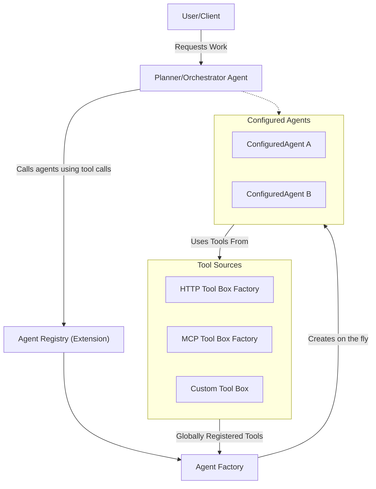

# Configured Agents and Registry

As powerful as single agents can be,  due to a variety of limitations like context window length, chances of hallucination
when large number of tools are exposed to the model etc., it is better to have agents that specialize in doing specific
tasks. A common pattern that works out well in a variety of scenarios is to have a high level agent that does the
planning and/or orchestration and delegates specific tasks to specialized agents.

To allow developers to implement this pattern easily, Sentinel AI provides a way to configure and manage multiple agents
through a centralized registry. This allows for easy access and management of different agents that can perform various 
tasks. The registry is implemented as an `AgentExtension` and can be added to any top-level agent implementation.

## Nomenclature

Let us understand a few fundamental constructs before we dive into the implementation details.

- `ConfiguredAgent`: This is an abstraction that represents an agent with a specific configuration.
- `AgentCapability`: Capabilities define what an agent gets access to. For example, HTTP tools, MCP tools,
  local/custom tools etc.
- `AgentConfiguration`: This represents the configuration details of an agent, including its name, description, input,
  output spec, capabilities and other settings.
- `AgentConfigurationSource`: The agent configuration source is responsible for providing the configuration details
  for an agent during the build process. A default in-memory source is provided, but you can implement your own source
  based off more permanent storage.
- `ConfiguredAgentFactory`: This factory is responsible for creating instances of configured agents based on the
  provided configuration.
- `AgentRegistry`: The agent registry is a centralized repository that holds all the configured agents. It allows for
  easy retrieval and management of agents and exposes required tools to a Sentinel AI agent to get details about agents
  and to invoke them to get work done.

All tools from different sources are registered globally with the `ConfiguredAgentFactory` and individual agents
get access to only those tools that they are configured to use. The factory is passed to the `AgentRegistry` extension.
All configured agents are listed from the `AgentConfigurationSource` and created on the fly as and when needed. A
summarized list of all configured agents is injected to the prompt sent to the model being used by the top-level
agent. The top-level agent can then invoke any of the configured agents as tools to get work done.

## Dependencies

To use the agent registry and configured agents, you need to include the following dependencies in your project:

```xml

<dependency>
    <groupId>com.phonepe.sentinel-ai</groupId>
    <artifactId>sentinel-ai-configured-agents</artifactId>
</dependency>
```

## Creating an Agent Factory

Use the builder on the `ConfiguredAgentFactory` to create an agent factory.

```java
final var agentFactory = ConfiguredAgentFactory.builder()
        .httpToolboxFactory(...) // Optional, if you want to provide HTTP capabilities
        .mcpToolboxFactory(...)  // Optional, if you want to provide MCP capabilities
        .customToolBox(...)   // Optional, if you want to provide custom/local capabilities
        .build();
```

## Agent Configuration Source

In order for Sentinel AI to be able to build agents on the fly, it needs to read agent configurations from an
`AgentConfigurationSource`. You can use `InMemoryAgentConfigurationSource` for testing or simple use cases where existing configurations can be
populated at runtime or loaded from somewhere more permanent.

```java
final var agentSource = new InMemoryAgentConfigurationSource();
```
## Agent Factory

`ConfiguredAgentFactory` is used to create instances of configured agents on the fly. It needs to be provided with
different toolboxes that agents can use based on their configured capabilities. ToolBoxes that can be completely
configure from outside, for example `HTTP ToolBox` and `MCP ToolBox` are created on the fly using ToolBox Factories.
```java
final var agentFactory = ConfiguredAgentFactory.builder()
        .httpToolboxFactory(...) // Optional, if you want to provide HTTP capabilities
        .mcpToolboxFactory(...)  // Optional, if you want to provide MCP capabilities
        .customToolBox(...)   // Optional, if you want to provide custom/local capabilities
        .build();
```
## Agent Registry
The `AgentRegistry` extension is used to manage and provide access to configured agents. It needs to be provided with
an `AgentConfigurationSource` to read agent configurations and an `ConfiguredAgentFactory` to create instances of configured
agents.

```java
final var agentRegistry = AgentRegistry.builder()
        .agentConfigurationSource(agentSource) //Mandatory
        .configuredAgentFactory(agentFactory::createAgent) //Mandatory
        .build();
```
The `AgentRegistry` extension can then be added to the top level `Agent` implementation.

```java
final var topAgent = PlannerAgent.builder()
                .setup(setup)
                .extension(registry)
                .build();

// Interact with the planner agent as usual
final var response = topAgent.executeAsync(AgentInput.<String>builder()
                                                   .request("Summarize the story of War and Peace")
                                                   .build())
        .join();
```

The `AgentRegistry` extension automatically injects a summarized list of all configured agents to the prompt sent to
the model being used by the top-level agent. It also exposes tools for the planner to get details like I/O schema of these
agents and to invoke them to get work done.

!!!tip "Sample planner agent implementation"
    The following is the trivial implementation of a planner agent that uses the agent registry extension to manage and
    invoke Configured Agents.
    
    ```java
        public class PlannerAgent extends Agent<String, String, PlannerAgent> {
            @Builder
            public PlannerAgent(
                    @NonNull AgentSetup setup,
                    @Singular List<AgentExtension<String, String, PlannerAgent>> extensions) {
                super(String.class,
                      """
                              Your role is to perform complex tasks as specified by the user. You can achieve this by using
                               the other agents.
                              """,
                      setup,
                      extensions,
                      Map.of());
            }
    
            @Override
            public String name() {
                return "planner-agent";
            }
        }
    ```

### Configuring Agents
Agents can be configured using the `AgentConfiguration` class. Such agents need to be registered with the `AgentRegistry`
by calling the `configureAgent` method. The registry in-turn invokes the `AgentConfigurationSource::save` method to 
persist the configuration and the `ConfiguredAgentFactory` to create an instance of the agent on the fly as and when
needed.

```java
// Create agent configuration
final var summarizerAgentConfig = AgentConfiguration.builder()
        .agentName("Summarizer Agent") //(1)!
        .description("Summarizes input text") //(2)!
        .prompt("Provide a 140 character summary for the provided input text") //(3)!
        .inputSchema(JsonUtils.schemaForPrimitive(String.class, "rawTextInput", mapper)) //(4)!
        .outputSchema(JsonUtils.schema(SummarizerAgentOutput.class)) //(5)!
        .capability(AgentCapabilities.remoteHttpCalls(Map.of("weatherserver", //(6)!
                                                             Set.of("get_weather_for_location"))))
        .capability(AgentCapabilities.mcpCalls(Map.of("mcp", Set.of("add"))))
        .build();

// Register agent configuration with the registry
agentRegistry.configureAgent(summarizerAgentConfig);
```

1. Name of the agent (Mandatory)
2. Description of the agent (Mandatory)
3. Prompt to be used by the agent (Mandatory)
4. Input schema for the agent. (Optional, defaults to a simple string input schema)
5. Output schema for the agent (Optional, defaults to a simple string output schema)
6. Capabilities of the agent (Optional, defaults to no capabilities). See section on [Tools for Configured Agents](#tools-for-configured-agents) for more details.

!!!tip "Schema generation"
    You can use the `JsonUtils.schemaForPrimitive` and `JsonUtils.schema` utility functions to generate schema in the
    required format for primitive types/string and classes/records respectively.

#### Agent Configuration Parameters
The following parameters can be configured using the `AgentConfiguration` builder.

| Builder Parameter | Mandatory | Description                                                 |
|-------------------|-----------|-------------------------------------------------------------|
| agentName         | Yes       | Name of the agent to be configured.                         |
| description       | Yes       | Detailed description of the agent.                          |
| prompt            | Yes       | System prompt to be used for the agent.                     |
| inputSchema       | No        | Input schema for the agent. Defaults to String if missing.  |
| outputSchema      | No        | Output schema for the agent. Defaults to String if missing. |
| capabilities      | No        | Extra capabilities of the agent.                            |

### Code-Based Agents
While many agents can be fully configured using JSON/YAML, you might need to register agents implemented entirely in Java. You can do this by extending the `RegisterableAgent` class and registering it with the `AgentRegistry`.

```java
public class MyCustomAgent extends RegisterableAgent<MyCustomAgent> {
    public MyCustomAgent(AgentSetup setup) {
        super(AgentConfiguration.builder()
                .agentName("custom-agent")
                .description("A custom agent implemented in Java")
                .build(),
              setup,
              List.of(),
              Map.of());
    }
}

// Registering the code-based agent
agentRegistry.register(new MyCustomAgent(setup));
```

## Planner-Worker Discovery

The `AgentRegistry` extension facilitates a "Planner-Worker" architecture by automatically exposing registered agents as tools to the parent agent. 

1. **Discovery via Facts**: The registry injects a list of all available agents (their names and IDs) into the system prompt as "Facts".
2. **Metadata Lookup**: If configured, the parent agent can use a tool to fetch the detailed I/O schema for a specific agent.
3. **Automated Tool Exposure**: The registry provides an `invokeAgent` tool to the parent. When the parent LLM decides to delegate a task, it simply calls this tool with the target `agentId` and the required input.

This mechanism allows Planner agents to dynamically discover and utilize any agent registered in the system without requiring explicit code changes to the Planner itself.

### Loading Agent configurations from file
Agent Configurations can be loaded into the registry directly into registry from serialized JSON using the following
functions:

- `loadAgentsFromContent(byte[] content)` - Load agent configurations from serialized JSON content.
- `loadAgentsFromFile(final String agentConfig)` - Load agent configurations from a file containing serialized JSON

Both methods return the list of agents that were loaded into the registry.

```java
// Load agent configurations from file
final var agents = agentRegistry.loadAgentsFromFile("path/to/agent_config.json");
```

#### Agent Configuration File Format

Sample file format can be found below:
```json
[
  {
    "agentName": "All-in-One Agent", //(1)!
    "description": "Agent with HTTP, MCP, and Custom Tool capabilities.", //(2)!
    "prompt": "Use all available tools to answer the query.", //(3)!
    "inputSchema": { //(4)!
      "type": "object",
      "additionalProperties": false,
      "required": [
        "location"
      ],
      "properties": {
        "location": {
          "description": "Location to know weather for",
          "type": "string"
        }
      }
    },
    "outputSchema": { //(5)!
      "type": "object",
      "properties": {
        "condition": {
          "type": "string"
        },
        "temperature": {
          "type": "string"
        }
      },
      "required": [
        "condition",
        "temperature"
      ],
      "additionalProperties": false
    },
    "capabilities": [ //(6)!
      {
        "type": "REMOTE_HTTP_CALLS", //(7)!
        "selectedTools": { //(8)!
          "weatherserver": [ //(9)!
            "get_weather_for_location" //(10)!
          ]
        }
      },
      {
        "type": "MCP", //(11)!
        "selectedTools": { //(12)!
          "mcp": [ //(13)!
            "add", //(14)!
            "subtract"
          ]
        }
      },
      {
        "type": "CUSTOM_TOOLS", //(15)!
        "selectedTools": [//(16)!
          "getWeather",
          "doSomethingCustom"
        ]
      }
    ]
  },
  ... //more agents
]
```

1. Name of the agent (Mandatory)
2. Description of the agent (Mandatory)
3. Prompt to be used by the agent (Mandatory)
4. Input schema for the agent. (Optional, defaults to a simple string input schema)
5. Output schema for the agent (Optional, defaults to a simple string output schema)
6. Capabilities of the agent (Optional, defaults to no capabilities).
7. Fixed for Remote HTTP calls.
8. HTTP tools exposed to this agent.
9. Name of HTTP upstream as specified in [HTTPToolboxFactory](#making-remote-http-calls){:target="_blank"} configuration.
10. Set of tools selected from this upstream.
11. Fixed for MCP calls.
12. MCP tools exposed to this agent.
13. Name of MCP upstream as specified when configuring MCP servers in [MCPToolBoxFactory](#using-tools-from-mcp-servers){:target="_blank"}.
14. Set of tools selected from this upstream.
15. Fixed for Custom/local tools.
16. Set of custom/local tools exposed to this agent as explained in [Using Custom Tools](#using-custom-tools){:target="_blank"}.

## Tools for Configured Agents

Configured agents can use tools from different sources. Sentinel AI provides built-in support for the following tool
sources:

- **HTTP ToolBox**: Tools that make remote HTTP calls to upstream services. Check the section on
  [HTTP ToolBox](./calling-remote-services.md){:target="_blank"} for more details.
- **MCP ToolBox**: Tools that make calls to MCP servers. Check the section on
  [MCP ToolBox](./using-mcp-servers.md){:target="_blank"} for more details.
- **Custom ToolBox**: Tools that are implemented in local code and registered with the agent factory.



When using Configured Agents and Agent Registry, tools from remote HTTP sources, MCP servers and local code are globally
registered to the AgentRegistry itself. Once registered, such tools can be used by individual agents as configured using
`AgentCapability` when configuring it. This prevents pollution of the prompts sent to models being used individual agents.

### Making remote HTTP calls
As we have seen in the section on [HTTP ToolBox](./calling-remote-services.md){:target="_blank"}, Sentinel AI provides a flexible
way to configure and expose HTTP API calls to upstream services as parameterized tools that agents can use.
The `HttpToolboxFactory` is used to create instances of `HttpToolbox` on the fly as and when needed.

```java
//Create HTTP Tool Source
final var toolSource = InMemoryHttpToolSource.builder() //Create tool source
                .mapper(MAPPER)
                .build();
//Bulk Load tools from YAML file
HttpToolReaders.loadToolsFromYAML(Paths.get("http-tools.yaml"), toolSource);

//Register custom HTTP tools to toolSource
toolSource.registerTool("my-service", ...);

//Add tools to toolSource any other way you want

//Create OkHttpClient instance to make the actual HTTP calls
final var okHttpClient = new OkHttpClient.Builder()
                ... //Custom configurations
                .build();
                
//Create and pass the HttpToolboxFactory to ConfiguredAgentFactory
final var agentFactory = ConfiguredAgentFactory.builder()
                .httpToolboxFactory(HttpToolboxFactory.builder() //All params mandatory
                                            .toolConfigSource(toolSource)
                                            .okHttpClient(okHttpClient)
                                            .objectMapper(objectMapper)
                                            .upstreamResolver(UpstreamResolver.direct())
                                            .build())
                .build();
```

!!!tip "OkHttp Client Provider"
    The `HttpToolboxFactory` class provides another builder `httpClientProvidingBuilder` which lets you configure a
    provider function that resolves to a specific instance of OkHttpClient depending on the upstream name.
    
    ```java
     HttpToolboxFactory.httpClientProvidingBuilder()
        .okHttpClientProvider(upstream -> myClientRegistery.getClient(upstream)) //or so on
        ...
        .build()
    ```

Once configured, tools from this factory can be used by configured agents by using the 
`AgentCapabilities.remoteHttpCalls` capability.


```java
final var weatherAgentConfig = AgentConfiguration.builder()
                //Standard config
                ...
                //Add http tool call capabilites
                .capability(AgentCapabilities.remoteHttpCalls(
                        Map.of("userservice", //Upstream name
                               Set.of("get_user_name", "get_location_from_user"),  //Set of tools from this upstream
                               "weatherserver", //Upstream name
                               Set.of("get_weather_for_location")  //Set of tools from upstream
                        )))
                .build();
```

### Using tools from MCP servers
Similar to `HttpToolboxFactory`, the `McpToolboxFactory` is used to create instances of `McpToolbox` on the fly as and
when needed. check the section on [MCP ToolBox](./using-mcp-servers.md){:target="_blank"} for more details on how to use
MCP servers with Sentinel AI.

```java
// Load MCP json config from file
final var mcpToolboxFactory = MCPToolBoxFactory.builder()
                                           .objectMapper(MAPPER)
                                           .build();

// (Optionally) Load MCP server details from mcp JSON file
mcpToolboxFactory.loadFromFile("/path/to/mcp_config.json");

// (Optionally) Register clients for specific upstreams programmatically
mcpToolboxFactory.registerMcpClient("my-upstream", mcpClient);

// Create agent factory and pass the MCP toolbox factory
final var agentFactory = ConfiguredAgentFactory.builder()
        .mcpToolboxFactory(mcpToolboxFactory)
        .build();
```
!!!tip "Custom MCP Client resolution"

    You can also provide a custom MCP client resolver function to the `McpToolboxFactory` builder that can resolve to a
    specific instance of
    `McpClient` depending on the upstream name. This is useful when you have multiple MCP clients to connect to different
    MCP servers and for some reason the registry won't work for you.

    ```java
     MCPToolBoxFactory.builder()
        .mcpClientProvider(upstream -> myMcpClientRegistery.getClient(upstream)) //or so on
        ...
        .build()
    ```

Once configured, tools from this factory can be used by configured agents by using the `AgentCapabilities.mcpCalls`
capability.

```java
final var mathAgentConfig = AgentConfiguration.builder()
                //Standard config, http tool boc factory etc
                ...
                //Add mcp tool call capabilites
                .capability(AgentCapabilities.mcpCalls(Map.of(
                        "metricservice", // Upstream/MCP server name as specified in MCP JSON config or during client registration
                        Set.of("load_timeseries"), // Set of tools from this MCP server
                        "mathservice", // Upstream/MCP server name
                        Set.of("multiply", "divide") // Set of tools from this MCP server
                    )));
                .build();
```

### Using Custom Tools
Custom tools are those that are implemented in local code and registered with the `ConfiguredAgentFactory`. Custom tools
can be used to perform tasks that are specific to your application or domain and cannot be easily achieved using remote
HTTP calls or MCP calls. Custom tools can be anything from simple utility functions to complex business logic
implementations. Custom tools are registered globally with the `ConfiguredAgentFactory` and individual agents get access to
only those tools that they are configured to use using the `AgentCapabilities.customToolCalls` capability.

```java
//Define tools as usual
@Tool("Provides the weather for a location")
public String getWeather(@JsonPropertyDescription("Name of the city to get weather for") final String city) {
    return """
            {
            "location" : "Bangalore",
            "temperature" : "33 centigrade",
            "condition" : "sunny"
            }
            """;
}

// Create a global custom tool box and register custom tools
final var globalCustomToolBox = CustomToolBox.builder()
                                       .name("custom")
                                       .build();

// Register tools
globalCustomToolBox.registerToolsFromObject(this);

// Register the custom tool box with the agent factory
final var agentFactory = ConfiguredAgentFactory.builder()
        .customToolBox(globalCustomToolBox)
        .build();
```

!!!tip "Registering tools of various types"
    The `CustomToolBox` class provides multiple ways to register tools.

Once the tools are registered globally with the `ConfiguredAgentFactory`, they can be used by configured agents by using
the `AgentCapabilities.customToolCalls` capability.

```java
// Create agent configured factory and register custom tools
final var agentConfig = AgentConfiguration.builder()
                //Standard config, http tool boc factory etc
                ...
                //Add custom tool call capabilites
                .capability(AgentCapabilities.customToolCalls(Set.of("getWeather", "getName")))
                .build();
```